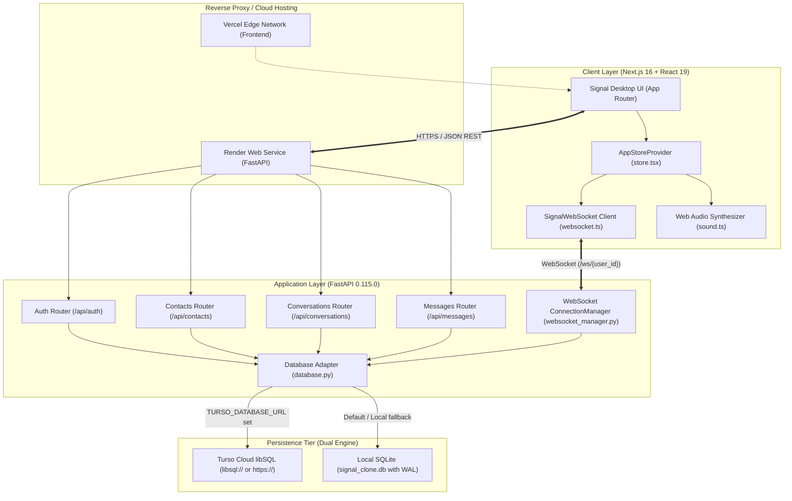
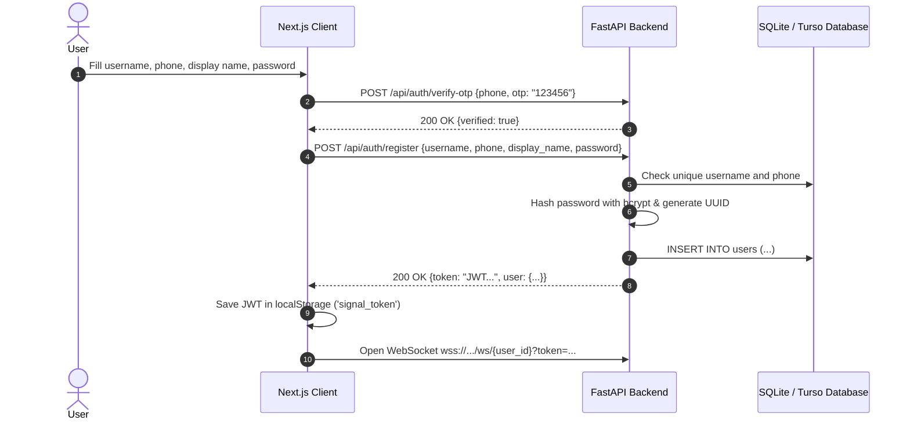
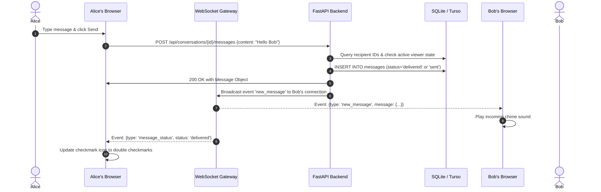
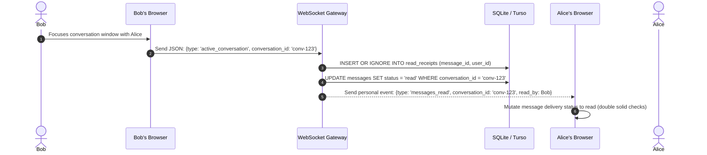
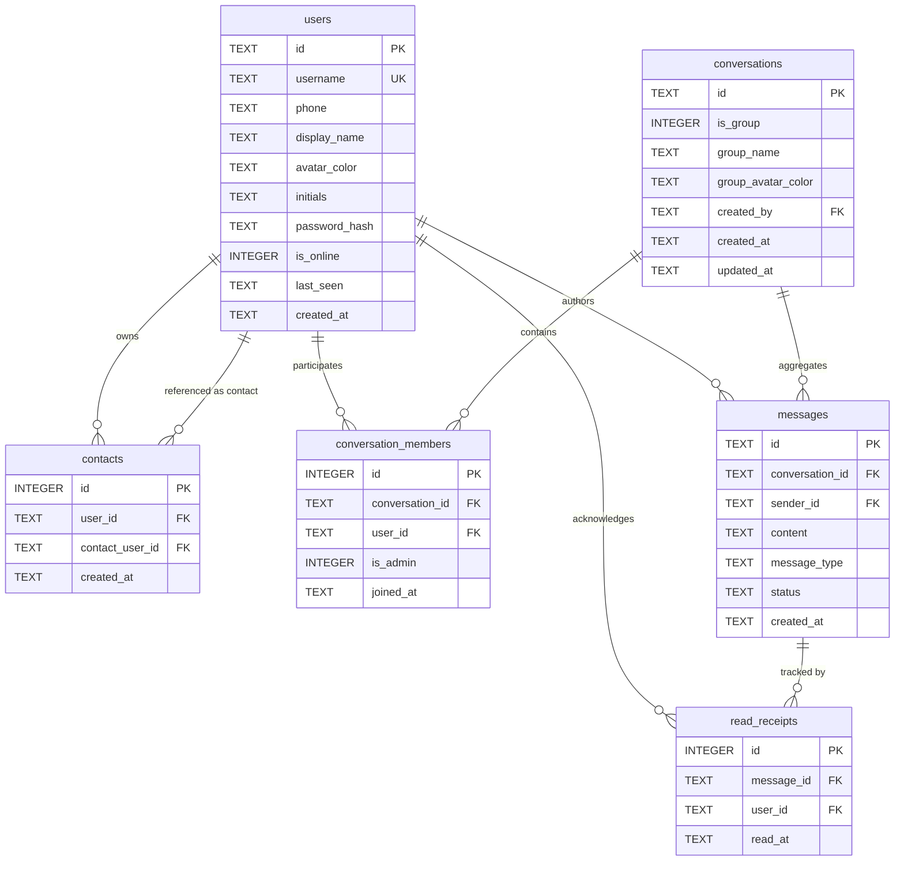

# Signal Messenger Clone (Desktop Web)

[](https://nextjs.org/)
[](https://react.dev/)
[](https://tailwindcss.com/)
[](https://fastapi.tiangolo.com/)
[](https://python.org/)
[](https://turso.tech/)
[](LICENSE)

A production-grade, full-stack desktop messaging application inspired by **Signal Desktop**. Engineered with a high-performance **FastAPI** asynchronous backend, dual-engine storage (**local SQLite** with WAL mode or serverless **Turso Cloud libSQL**), a reactive **Next.js 16 (Turbopack)** frontend, and real-time bidirectional communication over persistent **WebSockets**.

---

## Table of Contents

- [Signal Messenger Clone (Desktop Web)](#signal-messenger-clone-desktop-web)
  - [Table of Contents](#table-of-contents)
  - [Overview \& Project Description](#overview--project-description)
  - [Key Features \& Capabilities](#key-features--capabilities)
  - [System Architecture](#system-architecture)
    - [High-Level Architecture Diagram](#high-level-architecture-diagram)
    - [Core Sequence Flows](#core-sequence-flows)
      - [1. User Registration \& OTP Flow](#1-user-registration--otp-flow)
      - [2. Real-Time Message Dispatch \& Status Updates](#2-real-time-message-dispatch--status-updates)
      - [3. Read Receipt Lifecycle](#3-read-receipt-lifecycle)
  - [Technology Stack](#technology-stack)
    - [Frontend](#frontend)
    - [Backend](#backend)
    - [Database \& Storage](#database--storage)
    - [Deployment Infrastructure](#deployment-infrastructure)
  - [Database Architecture \& Schema](#database-architecture--schema)
    - [Entity-Relationship Diagram (ERD)](#entity-relationship-diagram-erd)
    - [Table Schemas](#table-schemas)
    - [Indexes](#indexes)
    - [Dual Database Engine Support](#dual-database-engine-support)
  - [WebSocket Communication Protocol](#websocket-communication-protocol)
    - [Connection Lifecycle](#connection-lifecycle)
    - [Client-to-Server Event Payloads](#client-to-server-event-payloads)
    - [Server-to-Client Event Payloads](#server-to-client-event-payloads)
  - [REST API Reference](#rest-api-reference)
    - [Authentication Endpoints](#authentication-endpoints)
    - [Contact Management Endpoints](#contact-management-endpoints)
    - [Conversation Endpoints](#conversation-endpoints)
    - [Message Endpoints](#message-endpoints)
    - [System \& Health Endpoints](#system--health-endpoints)
    - [Sample cURL Interactions](#sample-curl-interactions)
  - [Monorepo Directory Structure](#monorepo-directory-structure)
  - [Environment Variables](#environment-variables)
  - [Local Development Setup](#local-development-setup)
    - [Prerequisites](#prerequisites)
    - [1. Clone Repository](#1-clone-repository)
    - [2. Backend Setup](#2-backend-setup)
    - [3. Frontend Setup](#3-frontend-setup)
    - [4. Automated One-Click Launch (Windows)](#4-automated-one-click-launch-windows)
  - [Production Deployment](#production-deployment)
    - [Backend Deployment (Render)](#backend-deployment-render)
    - [Frontend Deployment (Vercel)](#frontend-deployment-vercel)
    - [Database Provisioning (Turso Cloud)](#database-provisioning-turso-cloud)
  - [Testing \& Verification](#testing--verification)
  - [Observability, Performance \& Scalability](#observability-performance--scalability)
  - [Security Considerations \& Auditing](#security-considerations--auditing)
  - [Known Limitations \& Implementation Status](#known-limitations--implementation-status)
  - [Troubleshooting Guide](#troubleshooting-guide)
  - [Contributing Guidelines](#contributing-guidelines)
  - [License](#license)

---

## Overview & Project Description

This repository contains a full-featured recreation of the Signal Desktop user experience designed for modern web browsers. It replicates Signal's desktop UI layout, typography, navigation rails, chat lists, message bubbles, status indicators, and modal workflows.

The system is organized as a clean monorepo containing:
- `backend/`: An asynchronous Python service built with FastAPI, utilizing `aiosqlite` for local development and `libsql-client` for connecting to distributed edge databases (Turso Cloud). It provides a full REST API and a WebSocket gateway for instant messaging.
- `frontend/`: A Next.js 16 (App Router) client built with React 19, TypeScript, and Tailwind CSS v4, featuring synchronized local storage states, Web Audio chime synthesis, modal overlays, and responsive UI components.

---

## Key Features & Capabilities

- **Real-Time Bidirectional Messaging**: Instant message delivery powered by persistent WebSockets with automated keep-alive pings (every 30s) and automatic exponential reconnection.
- **Three-Tier Delivery Receipts**: Complete message state lifecycle tracking (`sent` $\to$ `delivered` $\to$ `read`) with checkmark icons mirroring Signal Desktop.
- **Typing Indicator Waves**: Three-dot animated SVG pulse indicators broadcast to active conversation participants when typing.
- **Presence & Online Status**: Real-time broadcast of peer online/offline status changes and last-seen timestamps.
- **1:1 & Group Conversations**: Direct peer-to-peer chats, multi-user groups with customizable avatar colors and admin controls, plus a dedicated **Note to Self** loopback conversation.
- **Bidirectional Contact Management**: Search users by username, display name, or phone number, and establish reciprocal contact relationships.
- **Message Search**: Substring message history query engine with options to search globally or scope strictly to an active conversation or contact.
- **Audio Feedback**: Built-in sound generator using the HTML5 Web Audio API synthesizing authentic tones for outgoing sent messages, incoming deliveries, and pop clicks without external asset dependencies.
- **Signal Desktop UI Aesthetics**: Window title bars, a 54px left navigation rail, filterable conversation lists, emoji popover pickers, conversation hero screens, and dark/light themes.
- **Client-Side Product Features**: Pinning chats, archiving chats, muting notifications, setting disappearing timers, in-app poll creation & voting, and draft message caching (stored in browser local storage).

---

## System Architecture

### High-Level Architecture Diagram



---

### Core Sequence Flows

#### 1. User Registration & OTP Flow



#### 2. Real-Time Message Dispatch & Status Updates



#### 3. Read Receipt Lifecycle



---

## Technology Stack

### Frontend
- **Framework**: Next.js 16.3.4 (App Router, Turbopack enabled)
- **Language**: TypeScript 5 (`strict: true`)
- **Core Library**: React 19.2.8 & React DOM 19.2.8
- **Styling**: Tailwind CSS v4 (`@tailwindcss/postcss`) with CSS variable tokens
- **Icons**: `lucide-react` (1.41.0) and custom Signal SVG vector paths
- **Sound**: Native HTML5 Web Audio API procedural synthesis (zero external audio file dependencies)

### Backend
- **Framework**: FastAPI 0.115.0
- **ASGI Server**: Uvicorn 0.30.6 (Standard distribution with `uvloop` & `websockets`)
- **Language**: Python 3.11+
- **Security & Cryptography**: `python-jose[cryptography]` 3.3.0 (JWT HS256), `passlib[bcrypt]` 1.7.4, `bcrypt` 4.0.1
- **Data Validation**: Pydantic 2.9.2
- **Environment Management**: `python-dotenv` 1.0.0

### Database & Storage
- **Local Engine**: `aiosqlite` 0.20.0 (SQLite with `PRAGMA journal_mode=WAL` and `PRAGMA foreign_keys=ON`)
- **Cloud Engine**: `libsql-client` 0.3.1 (Turso Cloud libSQL over HTTPS / WebSocket transport)
- **Client Cache**: Browser `localStorage` for application state, theme, sound toggles, drafts, and UI preferences

### Deployment Infrastructure
- **Frontend Hosting**: Vercel (Next.js App Router edge platform)
- **Backend Hosting**: Render (Linux Web Service via `render.yaml`)
- **Live Database**: Turso Cloud libSQL distributed cloud instance

---

## Database Architecture & Schema

### Entity-Relationship Diagram (ERD)



---

### Table Schemas

#### `users`
| Column | Type | Constraints | Default | Description |
| :--- | :--- | :--- | :--- | :--- |
| `id` | `TEXT` | `PRIMARY KEY` | None (UUID4 string) | Unique identifier for the user account |
| `username` | `TEXT` | `UNIQUE NOT NULL` | None | Unique alphanumeric handle used for authentication |
| `phone` | `TEXT` | `NULL` | None | Verified user phone number |
| `display_name` | `TEXT` | `NOT NULL` | None | User's visible profile name |
| `avatar_color` | `TEXT` | `NULL` | `'#edd0c9'` | Hexadecimal color code used for fallback avatars |
| `initials` | `TEXT` | `NULL` | Derived | 1–2 character abbreviation displayed on avatars |
| `password_hash`| `TEXT` | `NOT NULL` | None | Bcrypt-hashed password digest |
| `is_online` | `INTEGER`| `NULL` | `0` | Boolean flag (`0` = offline, `1` = online) |
| `last_seen` | `TEXT` | `NULL` | None | ISO 8601 UTC timestamp of last disconnect |
| `created_at` | `TEXT` | `NULL` | `(datetime('now'))` | Timestamp when user was created |

#### `contacts`
| Column | Type | Constraints | Default | Description |
| :--- | :--- | :--- | :--- | :--- |
| `id` | `INTEGER` | `PRIMARY KEY AUTOINCREMENT` | Auto | Unique record identifier |
| `user_id` | `TEXT` | `NOT NULL REFERENCES users(id)` | None | Account owning the contact record |
| `contact_user_id`| `TEXT` | `NOT NULL REFERENCES users(id)` | None | Referenced user account added as contact |
| `created_at` | `TEXT` | `NULL` | `(datetime('now'))` | Timestamp of contact establishment |
| *Constraint* | `UNIQUE(user_id, contact_user_id)` | Enforces unique reciprocal pairing |

#### `conversations`
| Column | Type | Constraints | Default | Description |
| :--- | :--- | :--- | :--- | :--- |
| `id` | `TEXT` | `PRIMARY KEY` | None (UUID4 string) | Unique identifier for conversation room |
| `is_group` | `INTEGER` | `NULL` | `0` | `0` = 1:1 or Note to Self, `1` = Group |
| `group_name` | `TEXT` | `NULL` | None | Visible title for group conversations |
| `group_avatar_color`| `TEXT` | `NULL` | None | Hexadecimal color assigned to group header |
| `created_by` | `TEXT` | `REFERENCES users(id)` | None | Creator user identifier |
| `created_at` | `TEXT` | `NULL` | `(datetime('now'))` | Conversation creation timestamp |
| `updated_at` | `TEXT` | `NULL` | `(datetime('now'))` | Last message or activity timestamp |

#### `conversation_members`
| Column | Type | Constraints | Default | Description |
| :--- | :--- | :--- | :--- | :--- |
| `id` | `INTEGER` | `PRIMARY KEY AUTOINCREMENT` | Auto | Unique record identifier |
| `conversation_id`| `TEXT`| `NOT NULL REFERENCES conversations(id) ON DELETE CASCADE` | None | Foreign key linking conversation |
| `user_id` | `TEXT` | `NOT NULL REFERENCES users(id)` | None | Foreign key linking member user |
| `is_admin` | `INTEGER` | `NULL` | `0` | Group administrator permissions (`1` = admin) |
| `joined_at` | `TEXT` | `NULL` | `(datetime('now'))` | Timestamp member joined the conversation |
| *Constraint* | `UNIQUE(conversation_id, user_id)` | Prevents duplicate memberships |

#### `messages`
| Column | Type | Constraints | Default | Description |
| :--- | :--- | :--- | :--- | :--- |
| `id` | `TEXT` | `PRIMARY KEY` | None (UUID4 string) | Unique message identifier |
| `conversation_id`| `TEXT`| `NOT NULL REFERENCES conversations(id) ON DELETE CASCADE` | None | Parent conversation container |
| `sender_id` | `TEXT` | `NOT NULL REFERENCES users(id)` | None | Author user identifier |
| `content` | `TEXT` | `NOT NULL` | None | Text body or payload contents |
| `message_type` | `TEXT` | `NULL` | `'text'` | Message kind (`'text'`, `'system'`, `'poll'`) |
| `status` | `TEXT` | `NULL` | `'sent'` | Delivery stage (`'sent'`, `'delivered'`, `'read'`) |
| `created_at` | `TEXT` | `NULL` | `(datetime('now'))` | Message dispatch ISO timestamp |

#### `read_receipts`
| Column | Type | Constraints | Default | Description |
| :--- | :--- | :--- | :--- | :--- |
| `id` | `INTEGER` | `PRIMARY KEY AUTOINCREMENT` | Auto | Unique receipt entry |
| `message_id` | `TEXT` | `NOT NULL REFERENCES messages(id) ON DELETE CASCADE` | None | Target message confirmed as read |
| `user_id` | `TEXT` | `NOT NULL REFERENCES users(id)` | None | User who viewed the message |
| `read_at` | `TEXT` | `NULL` | `(datetime('now'))` | Timestamp receipt was marked |
| *Constraint* | `UNIQUE(message_id, user_id)` | Prevents redundant duplicate receipts |

---

### Indexes
To guarantee responsive querying at scale, the database defines the following indexes:
- `idx_messages_conversation`: `messages(conversation_id, created_at)` — Accelerates message history retrieval and pagination.
- `idx_conv_members_user`: `conversation_members(user_id)` — Optimizes conversation inbox discovery per user.
- `idx_conv_members_conv`: `conversation_members(conversation_id)` — Speeds up member resolution and broadcasting.
- `idx_contacts_user`: `contacts(user_id)` — Speeds up contact list loading.
- `idx_read_receipts_msg`: `read_receipts(message_id)` — Speeds up read receipt verification.

---

### Dual Database Engine Support

The backend incorporates an abstraction layer in [`backend/app/database.py`](backend/app/database.py) and [`backend/app/turso_client.py`](backend/app/turso_client.py):
1. **Turso Cloud Mode (Online)**: Activated automatically when `TURSO_DATABASE_URL` and `TURSO_AUTH_TOKEN` are set in the environment. Normalizes `libsql://` URLs to `https://` and wraps `libsql_client.Client` inside a connection adapter that emulates Python's `aiosqlite.Row` interface (supporting both key and index lookups).
2. **Local SQLite Mode (Fallback)**: When Turso credentials are absent, the application opens a local SQLite file (`signal_clone.db`), turns on Write-Ahead Logging (`PRAGMA journal_mode=WAL`), and enforces Foreign Key constraints (`PRAGMA foreign_keys=ON`).

---

## WebSocket Communication Protocol

Real-time interactions run over a single WebSocket endpoint: `GET /ws/{user_id}`.

### Connection Lifecycle
1. **Handshake**: The client initiates a WebSocket connection with its `user_id`.
2. **Online Registration**: The server registers the socket in `ConnectionManager`, updates `users.is_online = 1`, scans for undelivered messages to mark them as `delivered`, and broadcasts `user_status` to all connected peers.
3. **Keep-Alive Heartbeat**: The client sends a `{"type": "ping"}` packet every 30 seconds.
4. **Disconnection**: When the socket closes, if no other connections remain for that `user_id`, the server sets `users.is_online = 0`, updates `last_seen`, and broadcasts `user_status` (`is_online: false`) to peers.

---

### Client-to-Server Event Payloads

#### 1. Keep-Alive Ping
```json
{
  "type": "ping"
}
```

#### 2. Typing Indicator
```json
{
  "type": "typing",
  "conversation_id": "89304928-1b2c-4638-a298-2510b64d375a",
  "is_typing": true
}
```

#### 3. Single Message Read Receipt
```json
{
  "type": "read",
  "conversation_id": "89304928-1b2c-4638-a298-2510b64d375a",
  "message_id": "d4f3b610-1849-411a-826a-54316a1b15c0"
}
```

#### 4. Active Conversation Focus (Bulk Read)
```json
{
  "type": "active_conversation",
  "conversation_id": "89304928-1b2c-4638-a298-2510b64d375a"
}
```

---

### Server-to-Client Event Payloads

#### 1. Incoming Message (`new_message`)
```json
{
  "type": "new_message",
  "message": {
    "id": "c1f71f97-dbe3-4cf1-8840-7e87a2dce23a",
    "conversation_id": "89304928-1b2c-4638-a298-2510b64d375a",
    "sender_id": "user-uuid-1",
    "content": "Hey! Are you free to review this?",
    "message_type": "text",
    "status": "delivered",
    "created_at": "2026-09-08T10:00:00.000000Z",
    "sender": {
      "id": "user-uuid-1",
      "username": "priya",
      "display_name": "Priya Sharma",
      "avatar_color": "#edd9c9",
      "initials": "PS"
    }
  }
}
```

#### 2. Message Dispatch Confirmation (`message_sent`)
```json
{
  "type": "message_sent",
  "message": {
    "id": "c1f71f97-dbe3-4cf1-8840-7e87a2dce23a",
    "conversation_id": "89304928-1b2c-4638-a298-2510b64d375a",
    "status": "sent"
  }
}
```

#### 3. Message Status Update (`message_status`)
```json
{
  "type": "message_status",
  "message_id": "c1f71f97-dbe3-4cf1-8840-7e87a2dce23a",
  "conversation_id": "89304928-1b2c-4638-a298-2510b64d375a",
  "status": "read",
  "read_by": "user-uuid-2"
}
```

#### 4. Bulk Read Confirmation (`messages_read`)
```json
{
  "type": "messages_read",
  "conversation_id": "89304928-1b2c-4638-a298-2510b64d375a",
  "read_by": "user-uuid-2"
}
```

#### 5. Peer Typing Broadcast (`typing`)
```json
{
  "type": "typing",
  "conversation_id": "89304928-1b2c-4638-a298-2510b64d375a",
  "user_id": "user-uuid-2",
  "is_typing": true
}
```

#### 6. User Online/Offline Status (`user_status`)
```json
{
  "type": "user_status",
  "user_id": "user-uuid-2",
  "is_online": true
}
```

#### 7. Room Lifecycle Updates (`new_conversation` / `conversation_updated`)
```json
{
  "type": "conversation_updated",
  "conversation": {
    "id": "89304928-1b2c-4638-a298-2510b64d375a",
    "is_group": true,
    "group_name": "Project Apollo",
    "group_avatar_color": "#c9d5ed",
    "members": [...]
  }
}
```

---

## REST API Reference

All protected endpoints require an HTTP Authorization header formatted as:
`Authorization: Bearer <JWT_TOKEN>`

### Authentication Endpoints
| Method | Path | Auth Required | Request Body | Response Body | Description |
| :--- | :--- | :--- | :--- | :--- | :--- |
| `POST` | `/api/auth/register` | None (Public) | `{"username": str, "phone": str, "display_name": str, "password": str}` | `{"token": str, "user": UserResponse}` | Register new account and issue JWT |
| `POST` | `/api/auth/login` | None (Public) | `{"username": str, "password": str}` | `{"token": str, "user": UserResponse}` | Authenticate credentials and issue JWT |
| `POST` | `/api/auth/verify-otp`| None (Public) | `{"phone": str, "otp": str}` | `{"verified": bool, "message": str}` | Mock verification endpoint (accepts `123456`) |
| `GET` | `/api/auth/me` | Bearer Token | Empty | `UserResponse` | Fetch authenticated profile details |

### Contact Management Endpoints
| Method | Path | Auth Required | Request Body | Response Body | Description |
| :--- | :--- | :--- | :--- | :--- | :--- |
| `GET` | `/api/contacts` | Bearer Token | Empty | `UserResponse[]` | Retrieve current user's contact list |
| `POST` | `/api/contacts` | Bearer Token | `{"username": str?, "phone": str?}` | `UserResponse` | Add contact by handle or phone (bidirectional) |
| `DELETE`| `/api/contacts/{contact_user_id}` | Bearer Token | Empty | `{"ok": true}` | Remove specific contact relationship |
| `GET` | `/api/users/search?q={query}` | Bearer Token | Empty | `UserResponse[]` | Search users by handle, display name, or phone |

### Conversation Endpoints
| Method | Path | Auth Required | Request Body | Response Body | Description |
| :--- | :--- | :--- | :--- | :--- | :--- |
| `GET` | `/api/conversations` | Bearer Token | Empty | `ConversationResponse[]` | List user conversations sorted by activity |
| `POST` | `/api/conversations` | Bearer Token | `{"user_id": str}` | `ConversationResponse` | Create or open 1:1 or Note to Self chat |
| `POST` | `/api/conversations/group` | Bearer Token | `{"name": str, "member_ids": str[]}` | `ConversationResponse` | Create new group with creator as admin |
| `GET` | `/api/conversations/{id}` | Bearer Token | Empty | `ConversationResponse` | Fetch specific conversation details |
| `PUT` | `/api/conversations/{id}` | Bearer Token | `{"name": str?}` | `ConversationResponse` | Update group title (admin only) |
| `POST` | `/api/conversations/{id}/members` | Bearer Token | `{"user_id": str}` | `ConversationResponse` | Add member to group (admin only) |
| `DELETE`| `/api/conversations/{id}/members/{user_id}` | Bearer Token | Empty | `{"ok": true}` | Remove member (admin only or self-leave) |

### Message Endpoints
| Method | Path | Auth Required | Request Body | Response Body | Description |
| :--- | :--- | :--- | :--- | :--- | :--- |
| `GET` | `/api/messages/search?q={query}` | Bearer Token | Empty | `MessageSearchResult[]` | Global or scoped search across messages |
| `GET` | `/api/conversations/{id}/messages` | Bearer Token | Empty (Query: `limit=50`, `before=str?`) | `MessageResponse[]` | Paginated chronological message history |
| `POST` | `/api/conversations/{id}/messages` | Bearer Token | `{"content": str, "message_type": str?}` | `MessageResponse` | Post message and broadcast over WebSocket |
| `PUT` | `/api/conversations/{id}/messages/{msg_id}/read` | Bearer Token | Empty | `{"ok": true}` | Mark individual message as read |
| `PUT` | `/api/conversations/{id}/read` | Bearer Token | Empty | `{"ok": true}` | Mark all unread messages in room as read |

### System & Health Endpoints
| Method | Path | Auth Required | Response Body | Description |
| :--- | :--- | :--- | :--- | :--- |
| `GET`, `HEAD` | `/` | None (Public) | `{"status": "ok", "service": "Signal Clone API"}` | Root service check |
| `GET`, `HEAD` | `/health` | None (Public) | `{"status": "ok", "service": "Signal Clone API"}` | Standard health probe |
| `GET`, `HEAD` | `/api/health` | None (Public) | `{"status": "ok", "service": "Signal Clone API"}` | Prefixed health probe |

---

### Sample cURL Interactions

#### 1. Mock OTP Verification
```bash
curl -X POST https://signal-clone-lm5x.onrender.com/api/auth/verify-otp \
  -H "Content-Type: application/json" \
  -d '{"phone": "+1 555-0199", "otp": "123456"}'
```

#### 2. User Authentication
```bash
curl -X POST https://signal-clone-lm5x.onrender.com/api/auth/login \
  -H "Content-Type: application/json" \
  -d '{"username": "priya", "password": "demo123"}'
```

#### 3. Send Message
```bash
curl -X POST https://signal-clone-lm5x.onrender.com/api/conversations/CONV_ID/messages \
  -H "Content-Type: application/json" \
  -H "Authorization: Bearer YOUR_JWT_TOKEN" \
  -d '{"content": "Meeting starts in 5 minutes.", "message_type": "text"}'
```

---

## Monorepo Directory Structure

```text
signal-clone/
├── .gitignore                      # Git exclusion rules for node, venv, databases, env
├── AGENTS.md                       # Next.js workspace instruction guide
├── CLAUDE.md                       # Pointer reference to agent guidelines
├── render.yaml                     # Render Cloud blueprint for FastAPI backend
├── start.bat                       # One-click Windows launcher for backend & frontend
├── backend/
│   ├── requirements.txt            # Pinned Python package dependencies
│   ├── signal_clone.db             # Local SQLite database file (when Turso is not set)
│   └── app/
│       ├── __init__.py
│       ├── auth.py                 # JWT token generation, bcrypt hashing, auth routes
│       ├── contacts.py             # Contact relationship and user lookup endpoints
│       ├── conversations.py        # 1:1 and group conversation controllers
│       ├── database.py             # Unified SQLite & Turso async engine abstraction
│       ├── main.py                 # FastAPI application, CORS rules, and WebSocket gateway
│       ├── messages.py             # Message creation, pagination, and search routes
│       ├── models.py               # Pydantic schemas for request and response models
│       ├── seed.py                 # Database initialization and demo data seeder
│       ├── turso_client.py         # libSQL HTTP client adapter and row proxy
│       └── websocket_manager.py    # In-memory WebSocket connection manager
└── frontend/
    ├── package.json                # Next.js 16 dependencies and dev scripts
    ├── tsconfig.json               # TypeScript compiler configuration
    ├── postcss.config.mjs          # PostCSS configuration for Tailwind CSS v4
    └── src/
        ├── app/
        │   ├── globals.css         # Tailwind directives, Signal color variables, scrollbars
        │   ├── layout.tsx          # Root HTML layout and AppStoreProvider wrapper
        │   ├── page.tsx            # Main desktop messaging workspace interface
        │   ├── login/
        │   │   └── page.tsx        # Login authentication screen
        │   └── register/
        │       └── page.tsx        # 2-step registration with compulsory phone & OTP
        ├── components/
        │   ├── Avatar.tsx          # User/group circular avatar with fallback initials
        │   ├── ChatArea.tsx        # Active conversation header, message feed, and input
        │   ├── ChatHeader.tsx      # Conversation action bar and 3-dots dropdown menu
        │   ├── ChatListItem.tsx    # Individual chat entry with preview, timestamp, badge
        │   ├── ChatListSidebar.tsx # Left sidebar containing chat list, search, and folders
        │   ├── ConversationHero.tsx# Hero welcome banner shown on conversation startup
        │   ├── MessageBubble.tsx   # Message item with reactions, status checks, and replies
        │   ├── MessageInput.tsx    # Textarea, emoji trigger, and attachment buttons
        │   ├── NavSidebar.tsx      # 54px left navigation rail (Chats, Calls, Settings)
        │   ├── PollMessageBubble.tsx # Interactive in-chat poll widget
        │   ├── ReceiptIcon.tsx     # Single check, double check, and solid check SVGs
        │   ├── SignalIcons.tsx     # Custom Signal Desktop vector icons library
        │   ├── TitleBar.tsx        # Signal Desktop simulated window control bar
        │   ├── TypingIndicator.tsx # 3-dot typing pulse animation bubble
        │   ├── modals/             # Modal dialog components
        │   │   ├── AddContactModal.tsx
        │   │   ├── CallModal.tsx
        │   │   ├── ForwardToModal.tsx
        │   │   ├── GroupDetailsModal.tsx
        │   │   ├── KeyboardShortcutsModal.tsx
        │   │   ├── NewChatModal.tsx
        │   │   ├── NewGroupModal.tsx
        │   │   ├── PollCreateModal.tsx
        │   │   └── SettingsModal.tsx
        │   └── settings/           # Signal Desktop settings sub-views
        │       ├── SettingsSidebar.tsx
        │       └── SettingsView.tsx
        └── lib/
            ├── api.ts              # Fetch client wrapper and REST API functions
            ├── auth.tsx            # AuthProvider context managing JWT and session
            ├── sound.ts            # Web Audio API procedural sound synthesizers
            ├── store.tsx           # Global application store (conversations, messages)
            ├── utils.ts            # Date formatters, color mappers, and string utilities
            └── websocket.ts        # SignalWebSocket client with reconnect & ping logic
```

---

## Environment Variables

### Backend Configuration (`backend/.env`)
| Variable | Required | Default | Description |
| :--- | :--- | :--- | :--- |
| `DATABASE_PATH` | No | `signal_clone.db` in backend directory | Absolute or relative path to local SQLite database file |
| `TURSO_DATABASE_URL` | No | None (Unset) | Turso libSQL connection URI (`libsql://...` or `https://...`) |
| `TURSO_AUTH_TOKEN` | No | None (Unset) | Secret authentication token provided by Turso Cloud |
| `ALLOWED_ORIGINS` | No | `*` (or local defaults) | Comma-separated list of allowed origins or `*` for CORS |
| `PORT` | No | `8000` | Port used by Uvicorn server in production |

### Frontend Configuration (`frontend/.env.local`)
| Variable | Required | Default | Description |
| :--- | :--- | :--- | :--- |
| `NEXT_PUBLIC_API_URL` | Yes (in Cloud) | `http://localhost:8000` | Target URL pointing to backend REST API |
| `NEXT_PUBLIC_WS_URL` | Yes (in Cloud) | Derived from `NEXT_PUBLIC_API_URL` (`ws://` or `wss://`) | Target URL pointing to backend WebSocket gateway |

---

## Local Development Setup

### Prerequisites
- **Node.js**: v18.18.0 or v20+ recommended
- **Python**: v3.11.0 or v3.12+
- **Git**: Installed and configured on your system

---

### 1. Clone Repository
```bash
git clone https://github.com/NoiceBoink/signal-Clone.git
cd signal-Clone
```

---

### 2. Backend Setup
1. Navigate into the backend directory:
   ```bash
   cd backend
   ```
2. Create and activate a Python virtual environment:
   ```bash
   # On Windows (PowerShell/CMD):
   python -m venv venv
   .\venv\Scripts\activate

   # On macOS/Linux:
   python3 -m venv venv
   source venv/bin/activate
   ```
3. Install required Python packages:
   ```bash
   pip install -r requirements.txt
   ```
4. Configure environment variables:
   Create a `backend/.env` file:
   ```env
   # Leave empty to use local SQLite (signal_clone.db)
   # Or provide Turso credentials:
   # TURSO_DATABASE_URL=libsql://your-db.turso.io
   # TURSO_AUTH_TOKEN=your_token_here

   ALLOWED_ORIGINS=http://localhost:3000,http://127.0.0.1:3000
   ```
5. Initialize and seed database (optional, runs automatically on startup):
   ```bash
   python -m app.seed
   ```
6. Start the FastAPI development server:
   ```bash
   python -m uvicorn app.main:app --reload --port 8000
   ```
   The backend will be available at:
   - API Root: `http://localhost:8000`
   - Interactive Swagger Docs: `http://localhost:8000/docs`
   - ReDoc Documentation: `http://localhost:8000/redoc`

---

### 3. Frontend Setup
1. Open a new terminal and navigate to the frontend directory:
   ```bash
   cd frontend
   ```
2. Install dependencies:
   ```bash
   npm install
   ```
3. Create local environment file:
   Create a `frontend/.env.local` file:
   ```env
   NEXT_PUBLIC_API_URL=http://localhost:8000
   NEXT_PUBLIC_WS_URL=ws://localhost:8000
   ```
4. Start Next.js development server:
   ```bash
   npm run dev
   ```
5. Open your browser and navigate to:
   ```text
   http://localhost:3000
   ```

---

### 4. Automated One-Click Launch (Windows)
For convenience on Windows environments, run the provided root launcher:
```cmd
start.bat
```
This batch script will automatically spawn two separate command windows, launching the FastAPI backend on port 8000 and the Next.js development server on port 3000.

---

## Production Deployment

### Backend Deployment (Render)
The repository includes a ready-to-use [`render.yaml`](render.yaml) blueprint configuring a Python web service:
1. Push your code to your GitHub repository.
2. Sign in to [Render](https://render.com) and create a **New Web Service** linked to your repository.
3. Apply the settings:
   - **Root Directory**: `backend`
   - **Environment**: `Python`
   - **Build Command**: `pip install -r requirements.txt`
   - **Start Command**: `uvicorn app.main:app --host 0.0.0.0 --port $PORT`
4. Set Environment Variables in Render Dashboard:
   - `PYTHON_VERSION`: `3.11.9`
   - `TURSO_DATABASE_URL`: `libsql://your-turso-db.turso.io`
   - `TURSO_AUTH_TOKEN`: `your-turso-auth-token`
   - `ALLOWED_ORIGINS`: `*` (or your Vercel production domain)

*Live Deployed Production Backend*: `https://signal-clone-lm5x.onrender.com`  
*Live WebSocket URL*: `wss://signal-clone-lm5x.onrender.com`

---

### Frontend Deployment (Vercel)
1. Sign in to [Vercel](https://vercel.com) and import your Git repository.
2. In the project setup, set:
   - **Root Directory**: `frontend`
   - **Framework Preset**: `Next.js`
3. Under **Environment Variables**, configure:
   - `NEXT_PUBLIC_API_URL`: `https://signal-clone-lm5x.onrender.com`
   - `NEXT_PUBLIC_WS_URL`: `wss://signal-clone-lm5x.onrender.com`
4. Deploy the project.
5. **Important**: To allow public access without requiring team authorization or Vercel login, navigate to:
   *Project Settings $\to$ Deployment Protection $\to$ Vercel Authentication $\to$ Disabled*.

---

### Database Provisioning (Turso Cloud)
1. Install the Turso CLI or log in at [turso.tech](https://turso.tech).
2. Create a new database:
   ```bash
   turso db create signal-clone-db
   ```
3. Retrieve your database URL and generate an auth token:
   ```bash
   turso db show signal-clone-db --url
   turso db tokens create signal-clone-db
   ```
4. Copy the URL and token into your backend environment configuration (`TURSO_DATABASE_URL` and `TURSO_AUTH_TOKEN`). When the FastAPI app boots up, it will automatically connect, apply schema migrations, and seed default records.

---

## Testing & Verification

- **End-to-End Automated Testing**: Playwright test suites are located in the development scratch workspace:
  - `test_login_register_phone.py`: Tests user registration with compulsory phone verification, mock OTP submission, and home screen redirection.
  - `test_general_settings.py`: Verifies appearance settings, theme transitions (dark/light), and clear-data modals.
  - `test_keyboard_shortcuts.py`: Verifies modal shortcuts and keyboard interactions.
- **Unit & Integration Frameworks**: Standalone Jest, Vitest, or pytest test runners are *not currently configured in `package.json` or `requirements.txt`*.

---

## Observability, Performance & Scalability

- **Application Logging**: Python's standard `logging` library is configured to output `INFO` level logs for database connections, schema updates, WebSocket handshakes, and route traffic.
- **Database Connection Management**: SQLite runs with WAL mode for non-blocking concurrent reads during writes. The Turso client uses asynchronous HTTP requests with persistent HTTP/2 connection pooling.
- **WebSocket Scaling Boundary**: The current `ConnectionManager` maintains active client connections in Python memory (`self.active_connections: Dict[str, List[WebSocket]]`).
  - *Current Status*: Optimized for single-instance deployments.
  - *Multi-Instance Scale*: Horizontally scaling the backend across multiple containers will require an external message broker (e.g., Redis Pub/Sub) to fan out WebSocket broadcasts across servers (*Not currently implemented / Not found in repository*).

---

## Security Considerations & Auditing

- **Password Storage**: Passwords are hashed using `bcrypt` via `passlib.context.CryptContext` with automatic salt generation.
- **Authentication**: Stateless HMAC-SHA256 JWT tokens with a 72-hour lifetime.
- **Secret Key Rotation**: The backend contains a fallback default key (`signal-clone-secret-key-2024-change-in-production`). For production deployments, this value should be moved to an environment variable (`SECRET_KEY`).
- **OTP Verification**: The OTP verification endpoint currently validates against a static mock code (`123456`). Connecting to an external SMS gateway provider (such as Twilio) is *not currently implemented*.
- **Encryption at Rest & In Transit**: Data is encrypted in transit over HTTPS and WSS. End-to-end encryption using the Signal Protocol (Double Ratchet / libsignal) is *not currently implemented / not found in the repository*; message contents are stored in plaintext in the database.

---

## Known Limitations & Implementation Status

| Feature / Subsystem | Repository Implementation Status | Notes |
| :--- | :--- | :--- |
| **Real-time Messaging & Read Receipts** | **Implemented** | Working via WebSocket and SQLite / Turso |
| **1:1 & Group Chats** | **Implemented** | Full creation, member management, and admin controls |
| **Note to Self** | **Implemented** | Dedicated self-chat loopback conversation |
| **Contacts Management & Search** | **Implemented** | Bidirectional contacts and search |
| **UI Sound Effects** | **Implemented** | Synthesized in browser via Web Audio API |
| **Signal Protocol (E2EE)** | **Not currently implemented** | Messages are stored unencrypted in database |
| **File & Media Storage (S3/Cloudinary)** | **Not currently implemented** | File/media message types are mocked in UI |
| **WebRTC Audio & Video Calling** | **Not currently implemented** | Simulated UI modal; no peer connection established |
| **SMS OTP Gateway (Twilio/MessageBird)**| **Not currently implemented** | Validates against mock code `123456` |
| **Redis WebSocket Pub/Sub** | **Not currently implemented** | Sockets managed in single-process memory |
| **Message Reaction Persistence** | **Partially implemented** | Handled in client React state; not saved to database |
| **Message Editing** | **Partially implemented** | Handled in client React state; not saved to database |

---

## Troubleshooting Guide

| Issue / Symptom | Root Cause | Recommended Fix |
| :--- | :--- | :--- |
| **404 Not Found on `/health`** | Old backend process running or incorrect URL | Health routes exist at `/`, `/health`, and `/api/health`. Verify that Uvicorn has reloaded. |
| **CORS Error on API Calls** | Frontend origin missing from `ALLOWED_ORIGINS` | Set `ALLOWED_ORIGINS=*` in `backend/.env` or on Render, or add your specific Vercel URL. |
| **WebSocket Connection Failed** | Protocol mismatch (`ws://` vs `wss://`) | Ensure HTTPS pages connect via `wss://`. When deploying to Render, use `wss://<your-subdomain>.onrender.com`. |
| **Vercel Deployment "Request Access"** | Vercel Deployment Protection enabled | In Vercel Project Settings, disable Vercel Authentication under Deployment Protection. |
| **Render Service Cold Starts** | Render free tier instance spinning down | Free tier instances spin down after 15 minutes of inactivity. Allow 30–50 seconds for the service to wake up. |
| **Turso Database Auth Error** | Invalid token or mismatched organization URL | Verify that `TURSO_DATABASE_URL` starts with `https://` or `libsql://` and that `TURSO_AUTH_TOKEN` is active. |

---

## Contributing Guidelines

1. **Fork the Repository**: Create a personal feature branch (`git checkout -b feature/amazing-feature`).
2. **Commit Your Changes**: Follow clear commit messages (`git commit -m "feat: add attachment upload handler"`).
3. **Keep Monorepo Clean**: Do not commit build artifacts (`.next/`, `dist/`, `.turbo/`, `signal_clone.db`).
4. **Push to the Branch**: Push your commits (`git push origin feature/amazing-feature`).
5. **Open a Pull Request**: Submit your pull request for review.

---

## License

This project is open-source software licensed under the **MIT License**.
